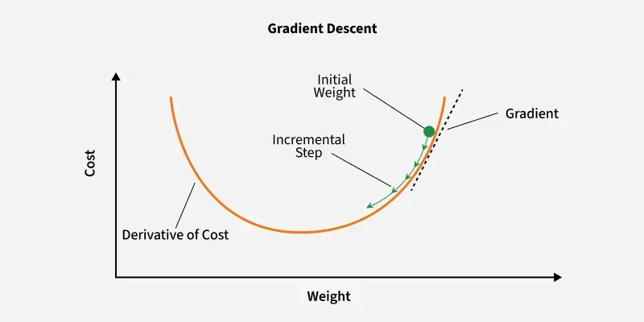
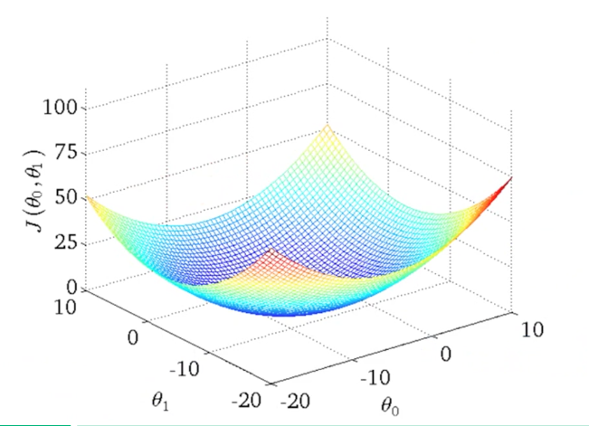
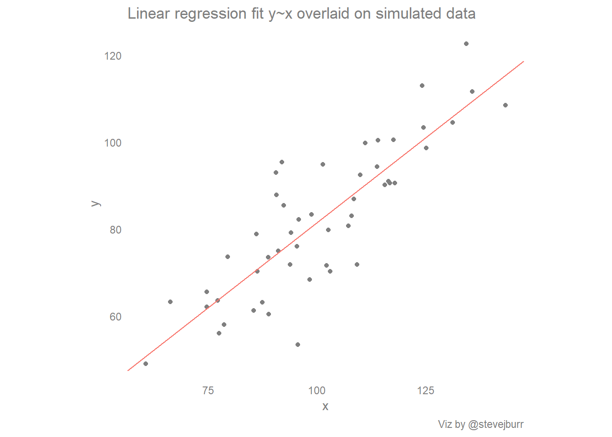
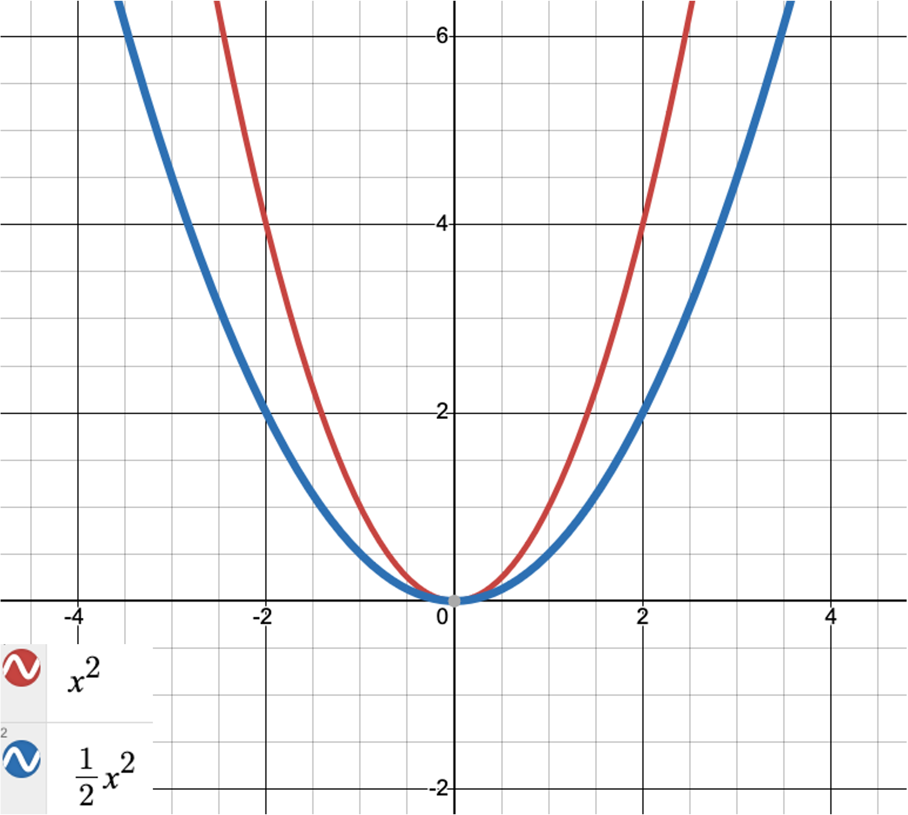

**Question:**  
Is it the same if I write  
$$
\frac{dC}{dA}\cdot\frac{dA}{dZ}\cdot\frac{dZ}{db}
$$
(how it is written in the [lectures](../Day3/Presentation/Day3_1_NeuralNetworksBackpropagation.pdf) and [ebook](http://neuralnetworksanddeeplearning.com/chap2.html))
or  
$$
\frac{dZ}{db}\cdot\frac{dA}{dZ}\cdot\frac{dC}{dA}
$$
(how 3Blue1Brown writes it [here](https://www.youtube.com/watch?v=Ilg3gGewQ5U&list=PLZHQObOWTQDNU6R1_67000Dx_ZCJB-3pi&index=3) and [here](https://www.youtube.com/watch?v=Ilg3gGewQ5U&list=PLZHQObOWTQDNU6R1_67000Dx_ZCJB-3pi&index=4))
when applying the chain rule for $\frac{dC}{db}$?

**Answer:**  
Yes—these are equivalent. Each factor is a number, and multiplication of numbers is commutative, so the product is the same regardless of order. Conceptually, the chain rule just matches dependencies along the path 
$$
C \to A \to Z \to b 
$$
. A quick way to see it is if you do the cancellations:
$$
\frac{dC}{\cancel{dA}}\cdot\frac{\cancel{dA}}{\cancel{dZ}}\cdot\frac{\cancel{dZ}}{db} \;=\; \frac{dC}{db}.
$$

**Example with fractions**  
Suppose
$$
\frac{dC}{dA}=\frac{1}{2},\quad \frac{dA}{dZ}=\frac{2}{3},\quad \frac{dZ}{db}=\frac{3}{5}.
$$
Then
$$
\frac{dC}{dA}\cdot\frac{dA}{dZ}\cdot\frac{dZ}{db}
= \frac{1}{2}\cdot\frac{2}{3}\cdot\frac{3}{5}
= \frac{1}{\cancel{2}}\cdot\frac{\cancel{2}}{\cancel{3}}\cdot\frac{\cancel{3}}{5}
= \frac{1}{5},
$$
and in the reversed order,
$$
\frac{dZ}{db}\cdot\frac{dA}{dZ}\cdot\frac{dC}{dA}
= \frac{3}{5}\cdot\frac{2}{3}\cdot\frac{1}{2}
= \frac{\cancel{3}}{5}\cdot\frac{\cancel{2}}{\cancel{3}}\cdot\frac{1}{\cancel{2}}
= \frac{1}{5}.
$$
Both give the same result, $\frac{dC}{db} = \frac{1}{5}$.

**Working out the math: what does this sequence of chained partial derivatives actually correspond to?**
This chain of partial derivatives actually corresponds to something. We can calculate each term analytically, fill in the numbers we got from forward propagation (such as the activations in each layer, or the weighted sum we calculated in the network in each layer), and so derive a number for each term. The final number, then, in this case, is the partial derivative of the cost wrt. a certain bias in the network. Here is an illustration, assuming a sigmoid activation function and the mean-squared error as the cost function: 

- Single example (one output):
    $$
    C \;=\; \frac{1}{2}\big(y - a^{(L)}\big)^2,\qquad a^{(L)} \;=\; \sigma\!\big(z^{(L)}\big),\qquad \sigma'(z)\;=\;\sigma(z)\big(1-\sigma(z)\big).
    $$
    Chain rule (either order):
    $$
    \frac{\partial C}{\partial b^{(L)}} \;=\; 
    \underbrace{\frac{\partial C}{\partial a^{(L)}}}_{-(y-a^{(L)})}\cdot
    \underbrace{\frac{\partial a^{(L)}}{\partial z^{(L)}}}_{\sigma'(z^{(L)})}\cdot
    \underbrace{\frac{\partial z^{(L)}}{\partial b^{(L)}}}_{1}
    \;=\; -(y-a^{(L)})\,\sigma'(z^{(L)})
    \;=\; (a^{(L)}-y)\,\sigma\!\big(z^{(L)}\big)\big(1-\sigma\!\big(z^{(L)}\big)\big).
    $$
    Reversing the multiplication order gives the same product because these are scalars (i.e. just numbers):
    $$
    \frac{\partial z^{(L)}}{\partial b^{(L)}}\cdot
    \frac{\partial a^{(L)}}{\partial z^{(L)}}\cdot
    \frac{\partial C}{\partial a^{(L)}}
    \;=\; 1\cdot \sigma'(z^{(L)})\cdot\big(-(y-a^{(L)})\big)
    \;=\; (a^{(L)}-y)\,\sigma'(z^{(L)}).
    $$

- Dataset of \(m\) examples (still one output, now including the **sum terms** for completeness):
    $$
    C \;=\; \frac{1}{2m}\sum_{i=1}^{m}\Big(y^{(i)} - a^{(L)}(i)\Big)^2,\qquad a^{(L)}(i)=\sigma\!\big(z^{(L)}(i)\big).
    $$
    Using [linearity of differentiation over the sum](https://handwiki.org/wiki/Sum_rule_in_differentiation), for each example \(i\):
    $$
    \frac{\partial C}{\partial a^{(L)}(i)} \;=\; -\frac{1}{m}\Big(y^{(i)} - a^{(L)}(i)\Big),\quad
    \frac{\partial a^{(L)}(i)}{\partial z^{(L)}(i)} \;=\; \sigma\!\big(z^{(L)}(i)\big)\Big(1-\sigma\!\big(z^{(L)}(i)\big)\Big),\quad
    \frac{\partial z^{(L)}(i)}{\partial b^{(L)}} \;=\; 1.
    $$
    Therefore the full derivative (either multiplication order) is
    $$
    \boxed{\;
    \frac{\partial C}{\partial b^{(L)}} 
    \;=\; \sum_{i=1}^{m}
    \frac{\partial C}{\partial a^{(L)}(i)}\cdot
    \frac{\partial a^{(L)}(i)}{\partial z^{(L)}(i)}\cdot
    \frac{\partial z^{(L)}(i)}{\partial b^{(L)}}
    \;=\; \frac{1}{m}\sum_{i=1}^{m}\Big(a^{(L)}(i) - y^{(i)}\Big)\,
    \sigma\!\big(z^{(L)}(i)\big)\Big(1-\sigma\!\big(z^{(L)}(i)\big)\Big)
    \;}
    $$
    which is identical whether you write the product as: 
    $$
    \frac{\partial C}{\partial a}\cdot\frac{\partial a}{\partial z}\cdot\frac{\partial z}{\partial b}
    $$ 
    or: 
    $$
    \frac{\partial z}{\partial b}\cdot\frac{\partial a}{\partial z}\cdot\frac{\partial C}{\partial a}
    $$

---

**Question:**  

What do you do when optimizing a neural network after you've chained all these partial derivatives together and arrived at the partial derivative of the cost wrt. each parameter?

**Answer:**  

You update all the parameters a little bit using the learning rate to take a small step down the gradient. Remember: like we discussed in the [very first lecture when talking about partial derivatives](../Day1/Presentation/Day1_1_IntroductionUnivariateLinearRegressionCostFunctionGradientDescent_1.pdf), you treat that big complicated neural net function (it is, in the end, one function, that takes feature inputs and delivers some outputs, like a class prediction) _as if_ it depends only on one parameter (say, a specific weight). You then calculate what step you should take to slightly improve that parameter. You do this not for only one weight, but for all weights and biases in the network. Once you know that, you update each of them with a tiny step, by subtracting alpha * gradient from the current value:

$$
\theta_{\text{new}} \;=\; \theta_{\text{old}} \;-\; \alpha \,\frac{\partial C}{\partial \theta}
$$

For a specific **weight** connecting neuron k in layer \(l-1\) to neuron j in layer \(l\) and the **bias** of neuron j in layer \(l\):

$$
w^{(l)}_{jk} \;\leftarrow\; w^{(l)}_{jk} \;-\; \alpha \,\frac{\partial C}{\partial w^{(l)}_{jk}},
\qquad
b^{(l)}_{j} \;\leftarrow\; b^{(l)}_{j} \;-\; \alpha \,\frac{\partial C}{\partial b^{(l)}_{j}}.
$$

To emphasize there are many such updates per neuron and per layer (with ellipses):

$$
\begin{aligned}
w^{(l)}_{j1} &\leftarrow w^{(l)}_{j1} - \alpha\,\frac{\partial C}{\partial w^{(l)}_{j1}} \\
w^{(l)}_{j2} &\leftarrow w^{(l)}_{j2} - \alpha\,\frac{\partial C}{\partial w^{(l)}_{j2}} \\
&\vdots \\
w^{(l)}_{jk} &\leftarrow w^{(l)}_{jk} - \alpha\,\frac{\partial C}{\partial w^{(l)}_{jk}} \\
&\vdots \\
b^{(l)}_{j} &\leftarrow b^{(l)}_{j} - \alpha\,\frac{\partial C}{\partial b^{(l)}_{j}}
\end{aligned}
$$

Apply these updates **for all layers and neurons**:
$$
\text{for } l=1,\dots,L,\quad j=1,\dots,n_l,\quad k=1,\dots,n_{l-1}.
$$

For *one weight*, that looks like one of the small arrows in the image below: one tiny step closer towards an optimum.

*Figure: Visualisation of how the cost function may depend on a certain weight. In reality, we don't know the parabola, we only calculate the gradient at each point, and can take a small step so we move down the gradient, thereby decreasing the cost a little.*

However, in reality, you are taking a step on this huge multidimensional cost function surface, using the only tools we have to do so (partial derivatives), hoping that by taking small steps while disregarding that parameters actually affect each other we can still reach a good-enough cost function minimum. See [here](https://losslandscape.com/) for a foray into trying to visualise these multidimensional neural network cost surfaces.

---

**Question:**  

What do you mean with the learning goal 'Explain what the 3D surface plot of the univariate linear regression cost function means'?

**Answer:**  

I just mean that you can explain what we covered in the [lectures on day 1](../Day1/Presentation/Day1_1_IntroductionUnivariateLinearRegressionCostFunctionGradientDescent_1.pdf): that actually the cost function depends on two parameters, the intercept and the slope ($\theta_0$ and $\theta_1$, or $b$ and $a$ if you think of $a x + b$), and so it is actually a surface in 3D space, like here:

*Figure: Visualisation of how the cost function actually depends on two parameters, and the global minimum of the cost for this univariate regression is defined by two parameters.*

Please note that this global minimum, when we look at how to minimise the cost (the mean-squared error), corresponds to the parameter values such that you get the optimal regression line as shown in the example below:

$$
y = \theta_1 x + \theta_0
$$

*Figure: Visualisation of the optimal parameters in data space. Each point $(x, y)$ has some cost (the squared distance to the regression line). The cost is minimal at certain parameter values $\theta_0$ and $\theta_1$.*

---

**Question:**  

Is  $\tfrac{1}{2m}\sum(\hat y - y)^2$ meaningfully different from $\tfrac{1}{m}\sum(\hat y - y)^2$?

**Answer:** No. They differ by a constant factor of $2$, which only scales the gradients. The minimum is in the same place. Notice that it just corresponds to $\frac{1}{2} \cdot \frac{1}{m} \cdot x^2$ versus $\frac{1}{m} \cdot x^2$. That difference just boils down to this:

*Figure: I drew both $\frac{1}{2}x^2$ and $x^2$. You may notice that the minimum is in the same place.*

The minimum is the same, and we are only using this function to minimize the cost. So it does not matter (the final parameters you find will be the same), except that the gradients are twice as large if you don't use $\frac{1}{2}$ versus if you do. So you should adjust the learning rate accordingly. But that's a detail you're allowed to forget~$\smile$

Here's both equations:
$$
C_{1/2} \;=\; \frac{1}{2m}\sum_{i=1}^m (\hat y_i - y_i)^2,
\qquad
C_{1} \;=\; \frac{1}{m}\sum_{i=1}^m (\hat y_i - y_i)^2
\;=\; 2\,C_{1/2}.
$$

We can calculate the gradients with respect to predictions:
$$
\frac{\partial C_{1/2}}{\partial \hat y_i} \;=\; \frac{1}{m}(\hat y_i - y_i),
\qquad
\frac{\partial C_{1}}{\partial \hat y_i} \;=\; \frac{2}{m}(\hat y_i - y_i)
\;=\; 2\,\frac{\partial C_{1/2}}{\partial \hat y_i}.
$$

By the chain rule, all parameter derivatives scale the same way:
$$
\frac{\partial C_{1}}{\partial \theta} \;=\; 2\,\frac{\partial C_{1/2}}{\partial \theta}.
$$

Why it doesn't matter:

- **Same minimum:** For any $c>0$, $\arg\min_\theta C(\theta) = \arg\min_\theta c\,C(\theta)$. So, $\frac{\partial C}{\partial \theta}=0 \iff \frac{\partial (cC)}{\partial \theta}=0$.
- **Just a rescale of the gradients and thereby of the learning rate:** Gradient descent with \(C_{1}\)
  $$
  \theta_{t+1} \;=\; \theta_t - \alpha\,\frac{\partial C_{1}}{\partial \theta}(\theta_t)
  \;=\; \theta_t - (2\alpha)\,\frac{\partial C_{1/2}}{\partial \theta}(\theta_t)
  $$
  is identical to using $C_{1/2}$ with learning rate $2\alpha$.

The $\tfrac{1}{2}$ is often included so that $\frac{d}{d\hat y}\big[\tfrac{1}{2}(\hat y-y)^2\big]=(\hat y-y)$ (no extra 2). Whether you include it or not is a convention; adjust the learning rate accordingly.
